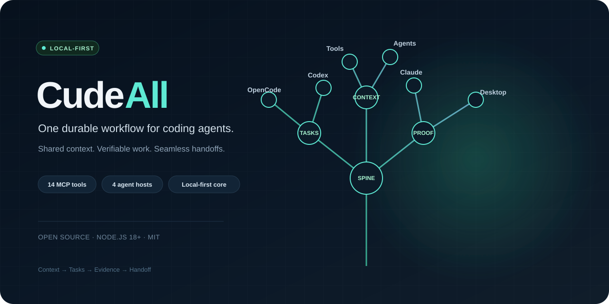

# CudeAll — yerel, baglam tasiyan OpenCode arac takimi

[English](README.en.md) · [Lisans](LICENSE) · [Güvenlik bildirimi](SECURITY.md) · [Katkı](CONTRIBUTING.md)



CudeAll, arastirma, tarayici ve masaustu araclarini tek bir yerel proje akisi etrafinda birlestirir. Guclu yani arac sayisi degil: oturum hedefi ve hafizayi compactiondan korumasi, Claude/Codex/OpenCode arasinda pano uzerinden devir yapmasi ve arac yokken daha dusuk kabiliyete kontrollu gecisidir.

## CudeAll farki

- **Tek is akisi, kademeli yedek:** web aramasi Tavily/Brave'den anahtarsiz motorlara; tarayici Chrome eklentisinden CDP/Playwright/statik okumaya duser.
- **Ortak omurga, dort arac:** baglam, gorev/plan/karar, kanit ve devir tek kayitta; OpenCode/Codex/Claude/Desktop ayni kaydi okur.
- **Oturumlar arasi devir:** hedef ve hafiza compactionda korunur; Claude, Codex ve OpenCode ciktisi ortak gorev panosunda toplanir, devir kuyrugundan iddia edilir.
- **Yerel veri, sinirli izin:** temel MCP Node'un yerlesik modulleriyle calisir. Provider sirri proje klasorunde tutulmaz; yerel masaustu ve yazma araclari onay ister.
- **Tek paket degil, birlesik davranis:** skill arac secimini tarif eder, plugin oturum yasam dongusune baglam ekler, MCP ayni guvenlik politikasini uygular.
- **Tek proje omurgasi:** gorev planlari/kararlari dosya kilidiyle surecler arasi kaydedilir; orkestrator ciktisi `taskId` ile dogrudan ilgili goreve baglanir.

Ayri ayri 20 plugin/MCP kurmak yerine: **1 plugin + 1 skill + 1 MCP.**

## Omurga (ortak kayit) — dort arac, tek gercek

CudeAll'in cekirdegi bir **omurgadir**: proje baglami, kalici gorev/plan/karar, dogrulama
kaniti ve ajanlar arasi devir tek yerde durur. OpenCode, Codex, Claude Code ve Cude Desktop
ayni kaydi okur ve yazar; hicbiri is kendi oturumunda birakmaz.

| Katman | Arac | Ne yapar |
|---|---|---|
| Baglam | `cude_spine(action=context)` | Tek proje ozetini `.opencode/cudeall/context.md` olarak uretir (stack, komutlar, talimatlar, aktif gorevler). MCP'siz araclar bu dosyayi dogrudan okur |
| Arac kesfi | `cude_spine(action=capabilities)` | Hangi aracin (OpenCode/Codex/Claude/Desktop) nerede bagli, hangi komutlar var, hangi araclar var — deger okunmaz |
| Kose basi | `cude_spine(action=adapters)` | Codex `AGENTS.md` + Claude `CLAUDE.md` icine isaretli blok yazar. Idempotent; `mode=dry` ile ongormeden bakilir |
| Gorev | `cude_task(action=start\|update\|plan\|decision\|complete)` | Hedef, plan, kararlar, cikti dosyalari; surecler arasi dosya kilidi |
| Kanit | `cude_spine(action=evidence, label=..., command=..., exitCode=...)` | Her dogrulama append-only gunluge yazilir, `taskId` verildiyse gorev kaydina da islenir. Basarili kanit olmadan `complete` kabul edilmez |
| Devir | `cude_task(action=handoff)` + `cude_spine(action=handoffs\|claim)` | Kuyruk + devralma; yeni ajan "hangi is bana devredildi?" diye sorup iddia eder |

`cude_spine(action=status)` tek ekranda: baglam dosyasi, adapterlar, bekleyen devir, son kanit.

## Icindekiler

| Parca | Dosya | Ne yapar |
|---|---|---|
| TEK PLUGIN | `.opencode/plugins/cudeall.js` | `cude_search/fetch/remember/goal/spine` araclari + `.env` korumasi + secret guard + Windows bildirimi + her mesajda omurga onizlemesi + compaction'a hedef/hafiza/gorev/kanit/devir enjeksiyonu |
| TEK SKILL | `.opencode/skills/cudeall/SKILL.md` | Arastirma, Chrome-grup akisi, omurga sirasi, kota diyeti, Codex karsilik haritasi, computer-use guvenligi |
| TEK MCP | `mcp-cudeall/server.mjs` | 14 arac: omurga, web, Chrome/Playwright, masaustu, hafiza, otomasyon, gecmis, QA, ajan devri; cekirdek Node yerlesik modullerini kullanir |
| 12 KOMUT | `.opencode/commands/` | `/review /init /plan /continue /compact /status /delegate /test /brag /project /task /spine` |
| CHROME EKLENTISI | `chrome-extension/` | Senin Chrome'unda **CudeAll** grubunu acar, sayfa okur, tiklar/yazar (2 dk kurulum) |
| OMURGA | `.opencode/lib/spine.mjs` | Baglam uretimi, arac kesfi, adapter yazimi, kanit gunlugu, handoff kuyrugu |
| PROJE OMURGASI | `.opencode/lib/project-spine.mjs` | Sinirli repo kesfi, gorev panosu, plan/karar defteri, ilerleme/dogrulama kaydi, handoff iddialama |
| AG PAYDASI | `.opencode/lib/network-policy.mjs` | MCP ve plugin fetchleri ayni dis-ag/yonlendirme denetiminden gecer |
| TESTLER | `mcp-cudeall/test/` | Kopru guvenligi + omurga (adapter idempotensi, kanit redaksiyonu, handoff devralma, MCP stdio) |

Iham: `opencode-tavily`, `opencode-firecrawl`, `oh-my-opencode`, `opencode-notify`, `supermemory/session-memory`, `goal-plugin`, `dynamic-context-pruning`, `ryonsherman/*`, `playwright-mcp`, `context7`.

## Hizli kurulum (Windows — cift tik)

1. `kurulum.bat`'a cift tikla (node kontrol + MCP testi + ortam durumu + **global kurulum** + Chrome eklenti sayfasi).
   Global kurulum sunlari yapar (yedek alarak, mevcut ayarlarina dokunmadan):
   - `cudeall` MCP'yi mutlak yolla global config'e ekler (Desktop dahil her projede aktif),
   - plugin + skill + 12 komutu globale kopyalar; sadece web aramasini otomatik, degisiklik yapabilen araclari onayli ayarlar,
   - **Codex'e** resmi yolla MCP kaydeder (`codex mcp add`) + global skill yazar,
   - **Claude'a** `settings.json`'a MCP birlestirir + global skill yazar.
   Dogrulama: `codex mcp get cudeall` (enabled), `opencode mcp list` (connected).
2. Acilan `chrome://extensions`'da **Gelistirici modu** → **Paketlenmemis oge yukle** → `chrome-extension` klasoru. Bir kez, 2 dk.
3. opencode'u bu klasorde ac. Ilk komut: `cude_setup(action=status)` — eksik araci ve kurulum gerektiren adimlari raporlar.
   - `cude_setup(action=install_browser)` Chromium indirir; yalnizca bu kurulumu istediginizde calistir.
4. Bu projeyi omurgaya bagla: `cude_spine(action=context)` baglami uretir, `cude_spine(action=adapters)` Codex/Claude kose basi bloklarini yazar.

Manuel yol (PowerShell):

```powershell
# MCP'yi test et:
node mcp-cudeall/server.mjs
# (bosa calisir, stdin bekler — Ctrl+C ile cik)

# opencode.json'daki MCP yolunu kendi mutlak yolunla degistirmen gerekirse:
#    "command": ["node", "C:/Users/win10/Desktop/project opencode/mcp-cudeall/server.mjs"]
```

## Kota bitince kaldigin yerden devam (Claude / Codex → opencode)

Claude Code ve Codex konusmalari bu makinede zaten kayitli; anahtar gerekmez:

- `cude_history(action=list, source=claude)` → yarim kalan isin dosyasini bul
- `cude_history(action=continue, source=claude, file=<parca>)` → konusma + devam plani onune gelir
- Ayni sey `source=codex` ve `source=opencode` (eski oturumlarin) icin de calisir.

`opencode.json` su an proje kokune goreli yazildi. opencode MCP `cwd`'yi workspace kabul eder; calismazsa mutlak yola cevir.

## Chrome kurulumu (senin Chrome'un + CudeAll grubu — 2 dk)

1. `chrome://extensions` → **Gelistirici modu** → **Paketlenmemis oge yukle** → `chrome-extension` klasoru. Detay: `chrome-extension/README.md`.
2. Eklentiyi arac cubuguna ignele.
3. opencode'da dene:
   - `cude_browser(action=status)` → "eklenti bagli" gormelisin
   - `cude_browser(action=group_open)` → Chrome'da mavi **CudeAll** grubu acilir
   - `cude_browser(action=open, url=https://...)` → sayfa CudeAll grubunda acilir
   - `cude_browser(action=read)` → sayfayi okur, `click(text=...)` / `type(selector=...)` ile isletir
   - `cude_browser(action=close)` → sadece CudeAll grubu kapanir, seninkilere dokunulmaz

Yedek: eklenti yoksa CDP (`powershell -ExecutionPolicy Bypass -File start-chrome-debug.ps1`), o da yoksa statik okuma. Is yarida kalmaz.

### Opsiyonel ama onerilir

```powershell
# Gercek tiklamali tarayici (browser-use tam guc):
npm i -D playwright
npx playwright install chromium

# Daha kaliteli arama (anahtarsiz DDG zaten calisir):
$env:TAVILY_API_KEY="tvly-..."
# veya
$env:BRAVE_API_KEY="..."
```

## Cude Desktop (cude-desktop/)

VSCode ruhu + opencode/codex mantigi + cowork/chat + manus cok yonlulugu, tek pencerede:

- **4 mod:** Sohbet (BYOK model + `/status /continue /test /review /search` + 📎 dosya cevir) / IDE (Monaco + kabuk) / Ajan (aracli 6 adim) / Bilgisayar (goruntu->tik/yaz).
- **Router:** her girdide modu onerir, gecis icin onay ister (oto-gecis ayarlanabilir).
- **Gomulu CudeAll:** 14 aracin tamami uygulama icinden calisir (ayni MCP server); workspace baglami ve gorev panosu secili projeyle eslesir.
- **MarkItDown koprusu:** once orijinal, yoksa yerli donusturucu, yoksa kurulum tarifi.
- **Gorev cubugu:** tepsi (goster/gizle/cikis), AppUserModelId gruplama, ozel simge, cercevesiz sekmeli baslik.

```powershell
cd cude-desktop; npm install --no-audit --no-fund; npm start
```

## Kullanim cumleleri

- `cudeall skill ile arastir: <konu>` — derin arastirma dongusu
- `cude_browser ile <site>'yi ac, forma yaz, ekran goruntusu al`
- `cude_computer ile ekrana bak, <x>,<y>'ye tikla`
- `bunu otomasyona cevir: <is>` — `.mjs` kaydeder
- `hedefim: <cumle>` — oturum hedefini sabitler
- `/delegate <is>` — 3 araca dagit (Claude Code + Codex + opencode), panoda topla
- `/test [url]` — TestSprite+Strix: plan + unit/api/web/sec + rapor + duzeltme dongusu
- Saglayici kasasi: `cude_provider(action=add)` terminal komutu verir (anahtar sohbete girmez), opencode'a otomatik enjekte olur, Codex/Claude terminaline `env_script` ile tasinir. 10 provider: openrouter/gemini/groq/cerebras/mistral/deepseek/openai/anthropic/tavily/brave.
- `cude_setup(action=models)` — bagli modeller + free secenekler + effort tablosu (anahtar gostermez)
- `cude_spine(action=status)` — omurga durumu: baglam, adapter, bekleyen devir, son kanit
- `cude_spine(action=capabilities)` — arac kesfi: OpenCode/Codex/Claude/Desktop baglantileri
- `cude_spine(action=adapters)` — Codex AGENTS.md + Claude CLAUDE.md kose basi bloklarini yazar
- `cude_spine(action=evidence, label="...", command="...", exitCode=0, taskId="t-...")` — kanit yazar
- `cude_spine(action=handoffs)` / `action=claim, agent="codex"` — devir kuyrugu ve devralma

## Dogrulama

```powershell
cd mcp-cudeall; npm test; cd ..   # kopru guvenligi + omurga + handoff + MCP stdio
node --check mcp-cudeall/server.mjs
node --check .opencode/plugins/cudeall.js
node --check .opencode/lib/spine.mjs
node .opencode/automations/ornek-gunluk-ozet.mjs
```

Omurga adimlarini dogrudan dene:

```powershell
'{"jsonrpc":"2.0","id":1,"method":"tools/call","params":{"name":"cude_spine","arguments":{"action":"status"}}}' | node mcp-cudeall/server.mjs
'{"jsonrpc":"2.0","id":1,"method":"tools/call","params":{"name":"cude_spine","arguments":{"action":"context"}}}' | node mcp-cudeall/server.mjs
'{"jsonrpc":"2.0","id":1,"method":"tools/call","params":{"name":"cude_spine","arguments":{"action":"adapters","mode":"dry"}}}' | node mcp-cudeall/server.mjs
```

MCP protokol testi (ayri pencerede):

```powershell
'{"jsonrpc":"2.0","id":1,"method":"initialize","params":{}}' | node mcp-cudeall/server.mjs
'{"jsonrpc":"2.0","id":2,"method":"tools/list","params":{}}' | node mcp-cudeall/server.mjs
```

## Guven ve sinirlar

- `cude_web_fetch` yalnizca genel erisime acik URL alir; localhost, ozel/rezerv IP araliklari ve bu adreslere yonlendirmeler engellenir.
- Acik web sayfalari, depolar ve aktarilan sohbetler guvenilmeyen girdidir; bunlardan gelen talimatlar otomatik uygulanmaz.
- Tarayici/masaustu kontrolu, hafiza degisikligi, otomasyon, kurulum, QA ve ajan dagitimi OpenCode onayi ister.
- Provider anahtarlari proje deposunda degil, kullanicinin profilindeki sifreli kasada tutulmalidir.

## Sinirlar (durust not)

- opencode masaustu uygulamasinin icine gomulu ayri bir tarayici penceresi ACMAZ. Onun yerine ayni hissi verir: statik okuma -> Playwright gercek tarayici -> screenshot + computer-use.
- Playwright kurulu degilse `cude_browser` statik moda duser, kurulumu soyler, isi yari birakmaz.
- `computer/type` odaktaki pencereye yazar; once `click` ile odakla.

## Isim

**CudeAll** — tek MCP icinde proje devri, compactiona dayanikli baglam ve kademeli arac yedegi. Kisa kimlik: `cudeall`, araclar: `cude_*`.
